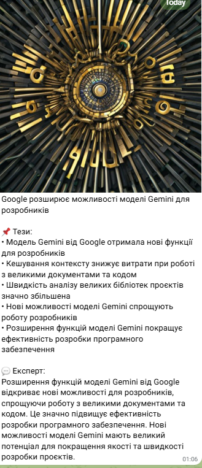

# AI Content Factory

Автоматична фабрика контенту: URL або текст → Gemini → зображення → Telegram і socials.

## Problem

Ручна підготовка поста для соцмереж займає **~60 хвилин**: прочитати матеріал, виділити тези, написати короткий пост і експертний коментар, підібрати/згенерувати картинку, опублікувати в кількох каналах.

## AI Solution

Один webhook-запит запускає ланцюжок:

1. **format_text.js** — скрейп URL (fallback: URL у промпт) або нормалізація тексту
2. **gemini_cached.js** — Gemini 2.0 Flash з JSON-кешем → `theses`, `short_post`, `expert_opinion`
3. **Pollinations.ai** — зображення за `short_post`
4. **n8n** — відправка в Telegram + HTTP-заглушки для socials

## Stack

| Компонент | Роль |
|-----------|------|
| **n8n** | Оркестратор workflow (Docker) |
| **Google Gemini** | Генерація тексту (мінімум токенів) |
| **Pollinations.ai** | Генерація зображення |
| **Node.js scripts** | format_text + gemini_cached |
| **Cursor** | Розробка та ітерація промптів |

## Result

**60 хв → ~30 сек** — один POST замість ручної роботи.

### Telegram screenshot




---

## Швидкий старт

### 1. Env

```bash
cp .env.example .env
# заповніть GEMINI_API_KEY, TELEGRAM_BOT_TOKEN, TELEGRAM_CHAT_ID
```

### 2. n8n (Docker)

```bash
docker run -d --name n8n \
  -p 5678:5678 \
  -v C:/Users/Admin/ai-content-factory:/data/ai-content-factory \
  -e SCRIPT_DIR=/data/ai-content-factory \
  -e GEMINI_API_KEY=your_key \
  -e GEMINI_MODEL=gemini-2.0-flash \
  -e TELEGRAM_BOT_TOKEN=your_token \
  -e TELEGRAM_CHAT_ID=your_chat_id \
  -e NODES_EXCLUDE="[]" \
  n8nio/n8n
```

> Windows: замініть шлях volume на ваш абсолютний шлях до проєкту.  
> `NODES_EXCLUDE="[]"` — увімкнути вузол Execute Command для скриптів.

### 3. Import workflow

1. Відкрийте http://localhost:5678
2. **Workflows → Import from File** → `workflows/foundation_ai_content_factory.json`
3. У вузлі **Telegram** підключіть credential бота
4. Активуйте workflow

### 4. Тест скриптів локально

```bash
node scripts/format_text.js --text "Штучний інтелект змінює маркетинг"
node scripts/gemini_cached.js --input "Штучний інтелект змінює маркетинг"
```

### 5. Webhook

```bash
curl -X POST http://localhost:5678/webhook/content-factory \
  -H "Content-Type: application/json" \
  -d "{\"text\": \"OpenAI та Google конкурують за ринок LLM\"}"
```

Або з URL:

```bash
curl -X POST http://localhost:5678/webhook/content-factory \
  -H "Content-Type: application/json" \
  -d "{\"url\": \"https://example.com/article\"}"
```

---

## Структура

```
ai-content-factory/
├── workflows/foundation_ai_content_factory.json
├── scripts/
│   ├── format_text.js
│   └── gemini_cached.js
├── prompts/system_min.txt
├── cache/gemini.json
└── docs/telegram-demo.png
```

## Вихід LLM

```json
{
  "theses": ["...", "..."],
  "short_post": "до 280 символів",
  "expert_opinion": "2-3 речення"
}
```

Кеш: `cache/gemini.json` — ключ SHA256(system + input).

## Social stubs

Вузли **Stub Twitter / LinkedIn / Facebook** шлють POST на `httpbin.org` — замініть URL на реальні API платформ.
